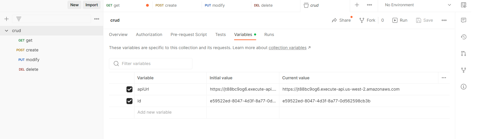

# Crud
- [Crud](#crud)
    - [Notes from the author](#notes-from-the-author)
    - [Getting Started](#getting-started)
    - [Commands](#commands)
      - [build](#build)
      - [clean](#clean)
      - [deploy](#deploy)
      - [down](#down)
      - [fmt](#fmt)
      - [test](#test)
      - [testv](#testv)
      - [gen](#gen)
      - [lint](#lint)
    - [API Endpoints](#api-endpoints)
      - [GET /user/{id}](#get-userid)
      - [POST /user](#post-user)
      - [PUT /user/{id}](#put-userid)
      - [DELETE /user/{id}](#delete-userid)
    - [Deploying](#deploying)
    - [Testing](#testing)

### Notes from the author

This project represents a reasonable approximation of what I consider to be a toy-level production-ready golang microservice.

Since this project is time-boxed to one week, I was forced to make a few trade-offs in quality for time sake.

To call out a few things I would change:

- Delegatinvg validation to the `user` package is a bit backwards and creates some awkwardness around handling requests. Specifically, the "UpdateUser" handler and `user.Parse`. What I should be doing is providing a OpenAPI schema, and then validating the request itself against that.

- Speaking of OpenAPI, there are some excellent code generation tools that I would likely involve around request validation. [oapi-codegen](https://github.com/deepmap/oapi-codegen) is widely used and could save writing some boilerplate around requests.

- A lot of the tests should be converted to table-based tests for readability sake, especially the tests having to do with validating lists of missing properties.

- Test code quality could be better in general. There is more copy-paste than I would prefer.

- I would like to have added a docker-compose based local DynamoDB development option, with a local smoke test running against the actual application.


Below is the TODO list I used while developing the project:

TODO:
- [WONT] Set up the serverless framework for local testing, etc.
- [DONE] Should deploy with Serverless deploy
- [DONE] Spin up DynamoDB
- [DONE] Enable the addition of a new user with fiels like userid, email. name, DOB, etc.
- [DONE] Fetch user information based on UserID
- [DONE] Modify exusting user details using UserID
- [DONE] Remove a user record based on UserID
- [DONE] /users (POST) to add a new user
- [DONE] /users/ GET to retrieve details of the user
- [DONE] PUT
- [DONE] DELETE
- [DONE] Error handling with descriptive error code and message
- [TODO] Run all commands in docker container
- [WONT] Local integration tests
- [WONT] Add test to ensure client is working
- [WONT] Interesting decisions section for readme
- [DONE] Update date fields to strings instead of time objects
- [DONE] move repo functions into own files
- [DONE] add proper check for existing user with email
- [DONE] Fix put request to behave a bit better

### Getting Started

This application requies a linux or Unix system to function.

On windows I hightly recommend the WSL2 linux emulation functionality.

To get started, you will need the following applications installed:

- [Serverless](https://www.serverless.com/)
- [Docker](https://www.docker.com/)
- [GoLang](https://go.dev/)
- [Make](https://www.gnu.org/software/make/) is likely already on your system.

I will leave configuring and installing these applications as an exercise for the reader.

### Commands

Commands for this project are centralized in a Makefile. 

#### build

```
make build
```

Build iterates through the `./handlers` folder and runs `go build` on each of them. 

This generates the binaries the serverless lambdas will execute when processing requests

#### clean

```
make clean
```

Clean removes artifacts from previous builds, and prepares the environment for the next version.

#### deploy

```
make deploy
```

Deploy calls the clean and build makefile commands, and then uses the serverless framework to deploy the code to AWS.

#### down

```
make down
```

Down deletes the entire stack created by the `deploy` command.

#### fmt
```
make fmt
```

This command runs `go fmt ./...` and formats source code.

In the future we may wish to add additional formatters so we can format various file types with one command.

#### test

```
make test
```

This command runs the golang test suite.

#### testv
```
make testv
```

This command runs the golang test suite in verboase mode

#### gen
```
make gen
```

This command runs automated code generation for our golang repositoires.

In the future we may wish to add a JSONSchema or documentation generation command.

#### lint
```
make lint
```

This command runs golangci-lint against our source code.

### API Endpoints

I have implemented a Postman collection that contains example queries for each of our APIs. If you would like an easy way to iterate and explore this API, I recommend importing the collection.

To update the ID and apiURL, navigate to the root collection, and edit the Variables tab:



The API consists of a single REST endpoint that supports the following operations:

- GET /user/{id}
- POST /user
- PUT /user/{id}
- DELETE /user]{id}

#### GET /user/{id}

This endpoint will operate as expected: If provided a valid ID, it will return a user object.

Otherwise, it will 404 or 500 based on the nature of the invalidity of the request.


#### POST /user

This endpoint will create a new user.

It expects a POST request with a json payload of the following format:

```
{
    "firstName": "Fred",
    "lastName": "Flintstone",
    "email": "fred@example.com", // Must be a valid email
    "DOB": "2020-12-09T16:09:53+00:00" // Must be a valid ISO8601 datetime
}
```

#### PUT /user/{id}

This endpoint will update the user identified by the provided ID.

It expects a PUT request with a JSON payload of the following format:

```
{
    "firstName": "Fred",
    "lastName": "Flintstone",
    "email": "fred@example.com",
    "DOB": "2020-12-09T16:09:53+00:00"
}
```

#### DELETE /user/{id}

This request will delete the resource with the provided ID.

### Deploying

To deploy this application, simply call `make deploy`.

This will build and deploy the application.

### Testing

Unit tests can be executed using the `make test` command.

For manual testing, it is recommended you `make deploy` to AWS, and get the API endpoint from the AWS console, and then use the provided postman collection to iterate on your changes.